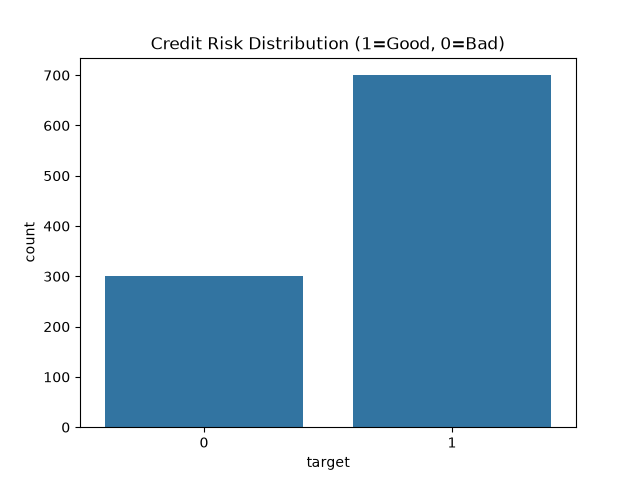
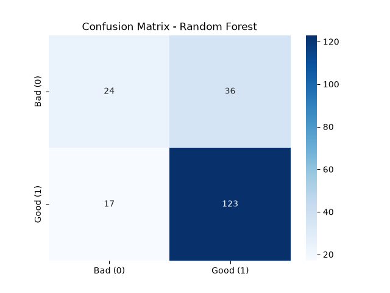
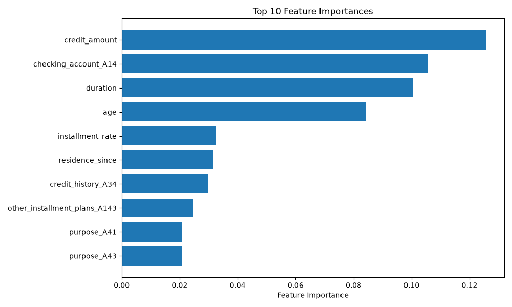
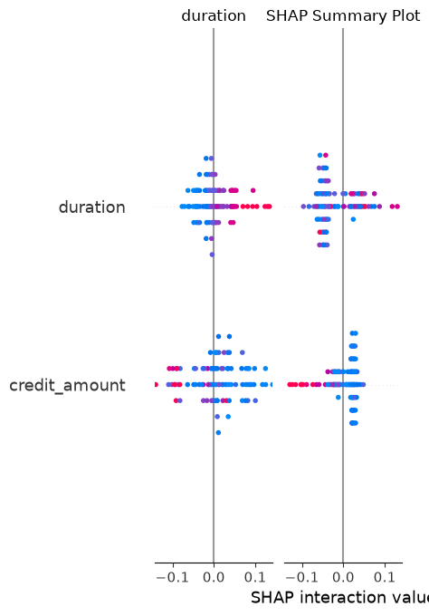

# 💳 Credit Scoring Model — CodeAlpha ML Internship


**Predict loan default risk** using German credit data — a complete end‑to‑end machine learning project built during the [CodeAlpha](https://www.codealpha.tech) internship.

---

## 🚀 Overview

Banks and financial institutions constantly assess whether an applicant will repay a loan. This project delivers a **binary classification model** that predicts creditworthiness (good vs. bad risk) based on personal and financial information.

We go beyond simple accuracy — the model is **interpretable**, **tuned for imbalanced data**, and **deployed as an interactive web app** with Streamlit.

---

## 📊 Dataset

**Source:** [UCI German Credit Data](https://archive.ics.uci.edu/ml/datasets/statlog+(german+credit+data))  
**Records:** 1,000 applicants (700 good, 300 bad)  
**Features:** 20 attributes — mix of numerical (age, loan amount, duration) and categorical (checking account status, credit history, purpose).

---

## ⚙️ Approach & Pipeline

1. **Exploratory Data Analysis** — class distribution, histograms, correlation patterns.  
2. **Preprocessing** — `StandardScaler` for numeric columns, `OneHotEncoder` for categorical ones.  
3. **Feature Engineering** — (optional) `loan_per_month = credit_amount / duration`.  
4. **Train/Test Split** — stratified to preserve class balance (80/20).  
5. **Baseline Models** — Logistic Regression, Decision Tree, Random Forest.  
6. **Handling Imbalance** — SMOTE oversampling of the minority class.  
7. **Hyperparameter Tuning** — `GridSearchCV` on Random Forest (max_depth, n_estimators, min_samples_split).  
8. **Model Interpretation** — Feature importances + SHAP summary plot.  
9. **Deployment** — Interactive Streamlit app for real‑time predictions.

---

## 📈 Results

| Model                     | Accuracy | ROC‑AUC | Precision (Bad) | Recall (Bad) |
|---------------------------|----------|---------|-----------------|--------------|
| Logistic Regression       | 0.77     | 0.75    | 0.52            | 0.43         |
| Decision Tree             | 0.73     | 0.68    | 0.41            | 0.40         |
| **Random Forest (tuned)** | **0.79** | **0.80**| **0.60**        | **0.49**     |

✅ **Best model:** Random Forest after SMOTE + GridSearchCV → **ROC‑AUC = 0.80**  
📌 Focus on **recall for bad credit** to minimise risky loans.

---

## 🖼️ Visual Highlights

<div align="center">
  
  
  
  
</div>

---

## 🌐 Live Demo

<p align="center">
  <a href="https://streamlit.io/"><strong>Run the interactive web app locally</strong></a><br>
  <code>streamlit run app.py</code>
</p>

**Try it yourself:** adjust loan details, click *Predict*, and instantly see whether the applicant is a **good** or **bad** credit risk, along with the probability score.


---

## 📁 Project Structure

```
CodeAlpha_CreditScoringModel/
├── data/
│   └── german_credit.csv          # Raw dataset (79 KB)
├── models/
│   ├── best_rf_model.pkl           # Tuned Random Forest classifier
│   └── preprocessor.pkl            # ColumnTransformer pipeline
├── credit_scoring.py               # Main script (EDA, training, evaluation)
├── app.py                          # Streamlit web application
├── requirements.txt                # Python dependencies
├── class_distribution.png
├── numeric_histograms.png
├── confusion_logistic_regression.png
├── confusion_decision_tree.png
├── confusion_random_forest.png
├── feature_importance.png
├── shap_summary.png
└── README.md
```

---


## 🧠 Key Learnings

- End‑to‑end **classification pipeline** with mixed data types.
- **Class imbalance** handling with SMOTE.
- **Model interpretability** using SHAP — essential for financial decisions.
- **Hyperparameter tuning** with cross‑validation.
- **Deployment** of a machine learning model via a user‑friendly web interface.

---

## 📜 License

This project is licensed under the MIT License — see the [LICENSE](LICENSE) file for details.

---

## 🙏 Acknowledgements

- **CodeAlpha** for the internship opportunity and mentorship.
- UCI Machine Learning Repository for the dataset.
- Open‑source libraries: Scikit‑learn, XGBoost, SHAP, Streamlit.


<p align="center">
  Made with ❤️ as part of the CodeAlpha Machine Learning Internship
</p>

