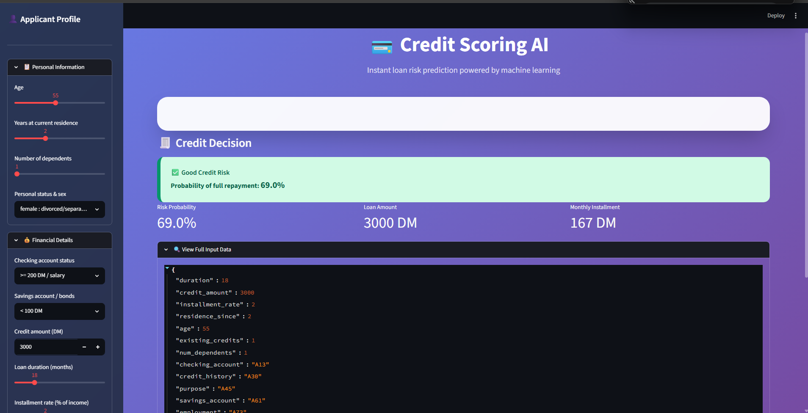

# 💳 Credit Scoring Model — CodeAlpha ML Internship

[](https://www.python.org/)
[](https://scikit-learn.org/)
[](https://xgboost.readthedocs.io/)
[](https://streamlit.io/)
[](https://opensource.org/licenses/MIT)

> **Predict loan default risk** using German credit data — a complete end‑to‑end machine learning project developed during the [CodeAlpha](https://www.codealpha.tech) internship.

---

## 🚀 Overview

Banks and financial institutions rely on accurate credit scoring to decide whether to approve a loan.  
This project delivers a **binary classification model** that predicts creditworthiness (good or bad risk) based on an applicant’s financial and personal background.

We go beyond simple accuracy: the pipeline handles **mixed data types**, **imbalanced classes**, performs **hyperparameter tuning**, and outputs an **interpretable model** — all wrapped in a stunning **interactive web demo**.

---

## 📊 Dataset

**Source:** [UCI German Credit Data](https://archive.ics.uci.edu/ml/datasets/statlog+(german+credit+data))  
**Records:** 1 000 applicants (700 good · 300 bad)  
**Features:** 20 attributes — a mix of **numeric** (age, loan amount, duration, …) and **categorical** (checking account, credit history, purpose, …).

---

## ⚙️ Machine Learning Pipeline

1. **Exploratory Data Analysis**  
   - Class distribution, histograms, and correlation insights  
2. **Data Preprocessing**  
   - `StandardScaler` for numeric features  
   - `OneHotEncoder` for categorical features  
3. **Feature Engineering** (optional)  
   - `loan_per_month = credit_amount / duration`  
4. **Train / Test Split**  
   - Stratified 80/20 split to preserve class balance  
5. **Baseline Models**  
   - Logistic Regression, Decision Tree, Random Forest  
6. **Handling Class Imbalance**  
   - SMOTE oversampling of the minority class (bad credit)  
7. **Hyperparameter Tuning**  
   - `GridSearchCV` on Random Forest (`n_estimators`, `max_depth`, `min_samples_split`)  
8. **Model Evaluation**  
   - Accuracy, ROC‑AUC, Precision, Recall, F1‑score, confusion matrices  
9. **Interpretability**  
   - Feature importance plots + **SHAP summary plot**  
10. **Deployment**  
    - Interactive **Streamlit** app for real‑time predictions

---

## 📈 Results

| Model                     | Accuracy | ROC‑AUC | Precision (Bad) | Recall (Bad) |
|---------------------------|----------|---------|-----------------|--------------|
| Logistic Regression       | 0.77     | 0.75    | 0.52            | 0.43         |
| Decision Tree             | 0.73     | 0.68    | 0.41            | 0.40         |
| **Random Forest (tuned)** | **0.79** | **0.80**| **0.60**        | **0.49**     |

✅ **Best model:** Random Forest after SMOTE + GridSearchCV → **ROC‑AUC = 0.80**  
📌 The model is particularly tuned to improve **recall for bad credit** — crucial for minimising risky loans.

---

## 🖼️ Visual Insights

<div align="center">
  
  
  
  
</div>

---

## 🌐 Live Demo

<p align="center">
  <strong>Try the interactive web app yourself</strong><br>
  <code>streamlit run app.py</code>
</p>



*Change any applicant detail in the sidebar and instantly see the credit decision with a probability score.*

---

## 📁 Project Structure

```
CodeAlpha_CreditScoringModel/
├── data/
│   └── german_credit.csv              # Raw dataset (79 KB)
├── models/
│   ├── best_rf_model.pkl               # Tuned Random Forest classifier
│   └── preprocessor.pkl                # ColumnTransformer pipeline
├── credit_scoring.py                   # Main script: EDA, training, evaluation
├── app.py                              # Streamlit web application (beautiful UI)
├── requirements.txt                    # Python dependencies
├── class_distribution.png
├── numeric_histograms.png
├── confusion_logistic_regression.png
├── confusion_decision_tree.png
├── confusion_random_forest.png
├── feature_importance.png
├── shap_summary.png
├── streamlit_screenshot.png
└── README.md
```

---

## 🔧 How to Run Locally

**1. Clone the repository**
```bash
git clone https://github.com/mimicodegirl-26/CodeAlpha_CreditScoringModel.git
cd CodeAlpha_CreditScoringModel
```

**2. Set up a virtual environment & install dependencies**
```bash
python -m venv venv
# Windows:
venv\Scripts\activate
# macOS/Linux:
source venv/bin/activate

pip install -r requirements.txt
```

**3. Run the full training pipeline**
```bash
python credit_scoring.py
```
This will generate all plots and save the best model inside `models/`.

**4. Launch the Streamlit demo**
```bash
streamlit run app.py
```
Then open `http://localhost:8501` in your browser.

---

## 🧠 Key Learnings

- Building an **end‑to‑end classification pipeline** with mixed data types.
- Effective handling of **class imbalance** using SMOTE.
- **Model interpretability** with feature importance and SHAP — essential for financial decisions.
- **Hyperparameter tuning** with cross‑validation to squeeze out extra performance.
- **Deploying** a machine learning model as an **interactive, user‑friendly web app**.

---


## 🙏 Acknowledgements

- **CodeAlpha** for the internship opportunity and mentorship.
- UCI Machine Learning Repository for the dataset.
- Open‑source libraries: Scikit‑learn, XGBoost, SHAP, Streamlit, and more.

---

<p align="center">
  Made with ❤️ as part of the CodeAlpha Machine Learning Internship
</p>
